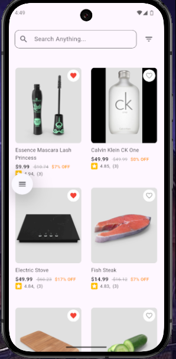
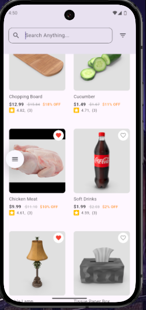
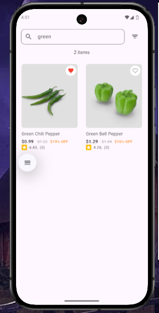
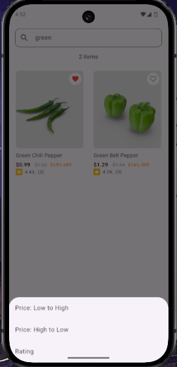
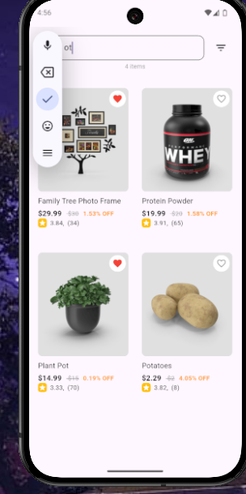
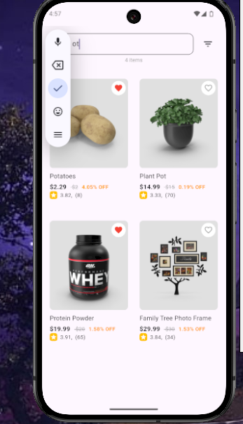
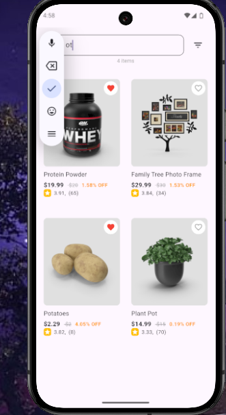

# Ecommerce_Product_Listing_App

This Flutter app fetches product data from an API (DummyJSON), implements infinite scrolling for pagination, and allows users to search and filter products by name, price, and rating. The app uses Riverpod 2.0 for state management.

## Screenshots

## Core Features Implemented

1. Product List
- Fetch products: The app fetches product data from DummyJSON API.
- Pagination: Infinite scrolling functionality.

2. Search & Filters
- Search: Users can search products by name.
- Sorting: Products can be sorted by price (low-high) or rating.

3. State Management
- Riverpod 2.0: Used for efficient state management to minimize unnecessary rebuilds.
